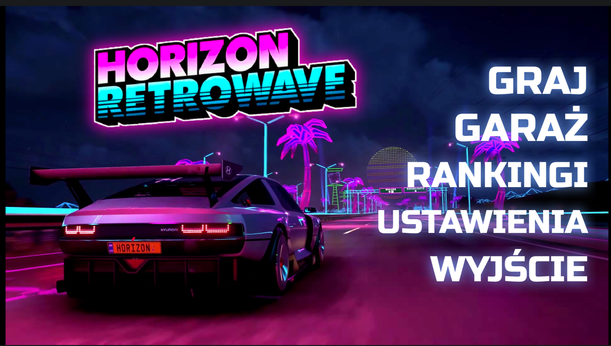
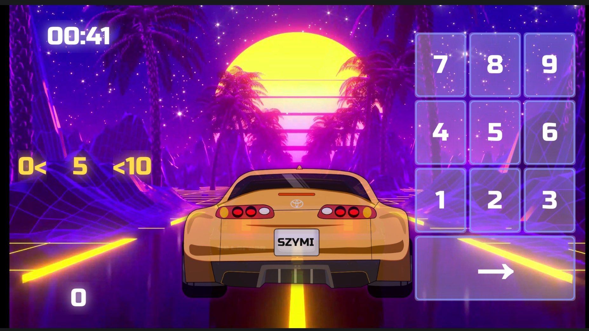
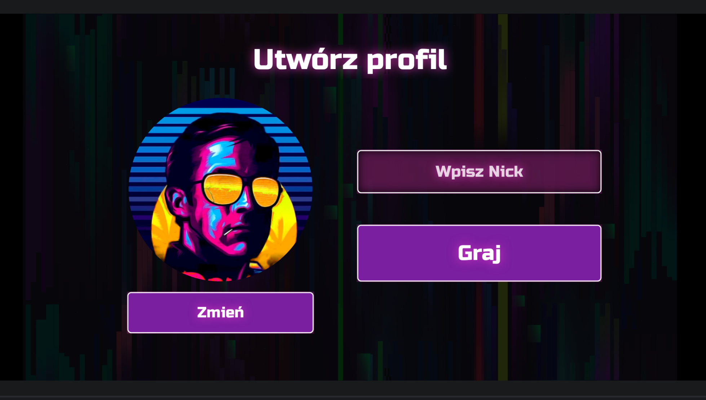

# (Zgadula) Horizon Retrowave
# Projekt na 6!

Disclaimer: ta wersja projektu z uwag ograniczeń github
nie posiada kilku dużych plików uniemożliwiając biuld projektu.

## Fraszka dla pana

### *Panie Radosławie,*
### *Proszę serdecznie o szósteczkę.*
### *Panie Radosławie,*
### *Inaczej musi pan znaleźć wymóweczkę!*

### *Panie Sobieraju,*
### *Pracowałem każdego dnia oraz nocy,*
### *Panie Sobieraju,*
### *Przez ten projekt opadłem z wszelkiej mocy!*

### *Panie Radku,*
### *Taki świetny projekt, zlituj się pan!*
### *Panie Radku,*
### *A w WPF piękne projekty panu dam!*

## Screeny:

